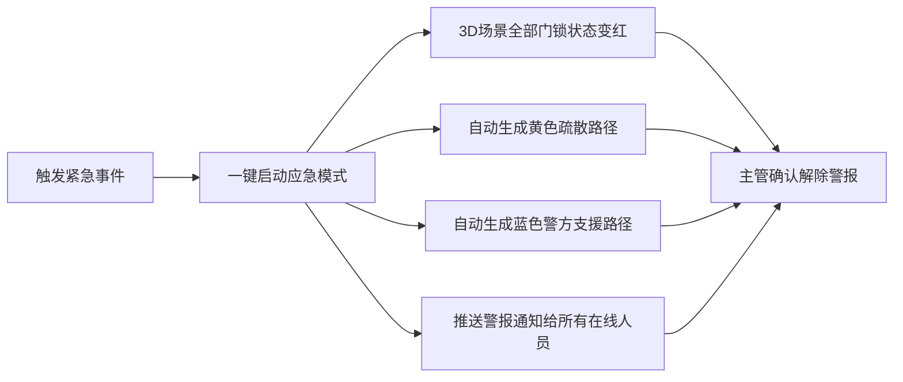
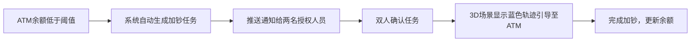

## 1. 产品概述
3D智慧银行网点运营与安全调度可视化平台，通过三维建模实时展示银行网点全貌，整合运营调度、安防监控、客流预测、应急指挥等核心功能，为银行管理者提供沉浸式、数据驱动的决策支持。
- 核心目标：实现银行网点运营全流程可视化与智能化调度，提升服务效率与安全等级
- 目标用户：银行柜员、网点主管、运营部管理人员

## 2. 核心功能

### 2.1 用户角色
| 角色 | 登录方式 | 核心权限 |
|------|----------|----------|
| 柜员 | 人脸识别登录 | 查看柜台排队、处理业务、设备报障 |
| 主管 | 人脸识别登录 | 柜员权限+排班调整、应急指挥、报表查看 |
| 运营部 | 人脸识别登录 | 主管权限+全网点调度、跨网点协调、日报导出 |

### 2.2 功能模块
1. **3D场景主界面**：营业大厅、自助区、VIP室、金库、监控中心五大区域3D展示
2. **柜台排队调度**：实时人数显示、超员预警、自动增开窗口、通知推送
3. **ATM现金管理**：余额实时监控、低余额告警、加钞任务、双人确认、3D轨迹引导
4. **金库安全管理**：人脸识别准入、非授权入侵警报、出入记录
5. **VIP客户服务**：预约登记、绿色3D箭头引导、超时自动释放
6. **客流预测与排班**：未来1小时客流预测、智能排班建议
7. **应急指挥系统**：一键紧急启动、自动锁门、疏散路径规划、警方路径
8. **设备运维管理**：设备状态监控、自动生成工单、维修进度跟踪
9. **报表导出系统**：业务量统计、现金库存统计、安防事件统计、Excel日报导出

### 2.3 页面详情
| 页面名称 | 模块名称 | 功能描述 |
|----------|----------|----------|
| 登录页 | 人脸登录模块 | 摄像头人脸识别、角色选择、登录日志记录 |
| 3D主场景 | 场景渲染模块 | 五大区域3D建模、自由视角漫游、区域快速跳转 |
| 3D主场景 | 柜台显示模块 | 每个柜台悬浮显示排队人数、超10人红色警告、自动开启动画 |
| 3D主场景 | ATM显示模块 | 现金余额显示、低于阈值黄色告警、加钞蓝色轨迹 |
| 3D主场景 | 金库安防模块 | 人脸识别入口、非授权红色警报闪烁 |
| 3D主场景 | VIP引导模块 | 绿色3D箭头引导路径、预约状态显示 |
| 侧边栏 | 客流预测面板 | 折线图显示未来1小时客流、排班建议列表 |
| 侧边栏 | 应急指挥面板 | 一键紧急按钮、锁门状态、疏散/警方路径开关 |
| 侧边栏 | 设备工单面板 | 故障设备列表、工单状态、分配处理人 |
| 侧边栏 | 通知中心 | 超员通知、加钞通知、警报通知 |
| 报表页 | 日报导出模块 | 业务量/现金/安防统计图表、Excel导出按钮 |

## 3. 核心流程

### 3.1 主流程
用户通过人脸识别登录系统 → 进入3D主场景总览 → 根据角色权限进行操作（排队调度/加钞处理/应急指挥/排班调整） → 查看或导出日报报表

### 3.2 紧急事件流程

### 3.3 加钞流程

## 4. 用户界面设计

### 4.1 设计风格
- **主色调**：深邃藏青蓝 `#0a1628` 为背景基色，搭配科技感霓虹蓝 `#00d4ff`、警戒红 `#ff4757`、安全绿 `#2ed573`、预警橙 `#ffa502`
- **视觉风格**：赛博朋克+金融科技风，暗色背景配发光边框、HUD全息投影效果、粒子光效
- **字体**：标题使用 `Orbitron` 科技感字体，正文使用 `Rajdhani` 清晰易读
- **按钮样式**：发光边框+渐变填充，悬停时脉冲光效，点击时涟漪动画
- **布局**：全屏3D场景为主体，左右两侧悬浮半透明HUD面板，顶部状态栏
- **图标风格**：线性发光图标，lucide-react 统一风格

### 4.2 页面设计概览
| 页面名称 | 模块名称 | UI元素 |
|----------|----------|--------|
| 登录页 | 人脸登录 | 中央圆形扫描框、动态扫描线、角色选择卡片、科技感背景粒子 |
| 3D主场景 | 场景区域 | 透视3D银行模型、发光区域标识、悬浮数据标签、实时动画 |
| 侧边栏 | 面板组件 | 半透明玻璃拟态、发光标题边框、滚动列表、动态图表 |
| 报表页 | 统计面板 | 数据卡片网格、ECharts图表、导出按钮 |

### 4.3 响应式设计
- Desktop优先设计，主场景自适应全屏
- 侧边面板可折叠收起，小屏自动隐藏为抽屉式
- 触摸设备支持双指缩放场景、单指旋转视角

### 4.4 3D场景指导
- **环境/HDRI**：使用室内银行环境贴图，暖白+冷蓝混合光源营造专业氛围
- **光照设置**：主方向光模拟大厅顶灯，点光源模拟柜台射灯，区域光营造柔和环境
- **相机设置**：默认俯视45°全局视角，支持鼠标拖拽旋转、滚轮缩放、点击区域聚焦
- **构图**：中央为营业大厅，周围分布自助区、VIP室、金库，监控中心在二层
- **交互与动画**：窗口开启有升降+光效动画，路径引导采用流动发光线条，警报时场景红色闪烁
- **后期处理**：泛光(Bloom)、轻微色差、环境光遮蔽(SSAO)增强质感
- **性能**：模型采用低多边形，总三角面控制在5万以内，使用实例化渲染重复元素
