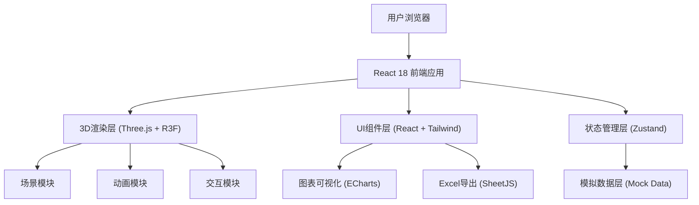

## 1. 架构设计



## 2. 技术描述
- **前端框架**：React 18 + TypeScript + Vite
- **3D引擎**：three @^0.160.0 + @react-three/fiber @^8.15.0 + @react-three/drei @^9.92.0 + @react-three/postprocessing @^2.15.0
- **样式方案**：TailwindCSS 3
- **状态管理**：Zustand @^4.4.0
- **图表库**：echarts @^5.4.0 + echarts-for-react @^3.0.0
- **Excel导出**：xlsx @^0.18.5 (SheetJS)
- **图标库**：lucide-react @^0.294.0
- **后端**：无后端，全部采用模拟数据驱动

## 3. 路由定义
| 路由 | 页面组件 | 用途 |
|------|----------|------|
| /login | LoginPage | 人脸识别登录页 |
| / | DashboardPage | 3D主场景控制台（默认） |
| /reports | ReportsPage | 日报统计与导出 |

## 4. 数据模型

### 4.1 核心数据类型

```typescript
// 用户角色
type UserRole = 'teller' | 'supervisor' | 'operation';

interface User {
  id: string;
  name: string;
  role: UserRole;
  faceId: string;
  lastLogin?: Date;
}

// 柜台
interface Counter {
  id: string;
  number: number;
  queueCount: number;
  isActive: boolean;
  isBackup: boolean;
  tellerId?: string;
}

// ATM机
interface ATM {
  id: string;
  name: string;
  cashBalance: number;
  threshold: number;
  status: 'normal' | 'low' | 'refilling' | 'offline';
  refillTask?: RefillTask;
}

// 加钞任务
interface RefillTask {
  id: string;
  atmId: string;
  createdAt: Date;
  confirmedBy: string[]; // 2人确认
  status: 'pending' | 'confirmed' | 'inProgress' | 'completed';
  path: [number, number, number][]; // 3D路径点
}

// 金库
interface Vault {
  id: string;
  isLocked: boolean;
  lastAccess?: Date;
  accessHistory: AccessRecord[];
  alertActive: boolean;
}

interface AccessRecord {
  userId: string;
  userName: string;
  timestamp: Date;
  authorized: boolean;
}

// VIP客户
interface VIPCustomer {
  id: string;
  name: string;
  appointmentId: string;
  appointmentTime: Date;
  status: 'waiting' | 'guided' | 'serving' | 'timeout';
  guidePath: [number, number, number][];
}

// 客流预测
interface ForecastData {
  time: string;
  predictedCount: number;
}

interface ScheduleSuggestion {
  period: string;
  suggestedTellers: number;
  reason: string;
}

// 紧急事件
interface Emergency {
  id: string;
  type: 'fire' | 'robbery' | 'intrusion' | 'other';
  active: boolean;
  startTime?: Date;
  doorsLocked: boolean;
  evacuationPath: [number, number, number][];
  policePath: [number, number, number][];
}

// 设备工单
interface WorkOrder {
  id: string;
  deviceId: string;
  deviceName: string;
  issue: string;
  status: 'pending' | 'assigned' | 'inProgress' | 'resolved';
  createdAt: Date;
  assignee?: string;
}

// 通知
interface Notification {
  id: string;
  type: 'queue' | 'refill' | 'alert' | 'info' | 'emergency';
  title: string;
  message: string;
  timestamp: Date;
  read: boolean;
}

// 日报数据
interface DailyReport {
  date: string;
  totalTransactions: number;
  counterStats: { counterId: string; transactionCount: number }[];
  cashInventory: { atmId: string; startBalance: number; endBalance: number; refilled: number }[];
  securityEvents: { time: string; type: string; description: string }[];
}
```

## 5. 项目目录结构
```
e:\solo\30/
├── src/
│   ├── components/
│   │   ├── ui/              # 通用UI组件（卡片、按钮、面板等）
│   │   ├── scene3d/         # 3D场景相关组件
│   │   │   ├── BankScene.tsx       # 主场景
│   │   │   ├── Counter3D.tsx       # 柜台3D组件
│   │   │   ├── ATM3D.tsx           # ATM 3D组件
│   │   │   ├── Vault3D.tsx         # 金库3D组件
│   │   │   ├── VIPLounge3D.tsx     # VIP室3D组件
│   │   │   ├── PathGuide.tsx       # 路径引导组件
│   │   │   └── Lights.tsx          # 灯光配置
│   │   ├── panels/          # 侧边面板组件
│   │   │   ├── QueuePanel.tsx      # 排队调度面板
│   │   │   ├── ForecastPanel.tsx   # 客流预测面板
│   │   │   ├── EmergencyPanel.tsx  # 应急指挥面板
│   │   │   ├── WorkOrderPanel.tsx  # 工单面板
│   │   │   └── NotificationPanel.tsx # 通知中心
│   │   └── layout/          # 布局组件
│   ├── pages/
│   │   ├── LoginPage.tsx           # 登录页
│   │   ├── DashboardPage.tsx       # 主控制台
│   │   └── ReportsPage.tsx         # 报表导出页
│   ├── store/
│   │   ├── useBankStore.ts         # 核心业务状态
│   │   └── useUserStore.ts         # 用户登录状态
│   ├── data/
│   │   └── mockData.ts             # 模拟数据
│   ├── utils/
│   │   ├── excelExport.ts          # Excel导出工具
│   │   └── helpers.ts              # 通用工具函数
│   ├── types/
│   │   └── index.ts                # TypeScript类型定义
│   ├── App.tsx
│   ├── main.tsx
│   └── index.css
├── api/                      # 预留（当前为空）
└── shared/                   # 共享类型
```
